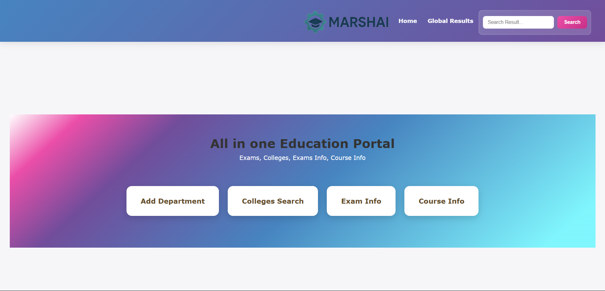
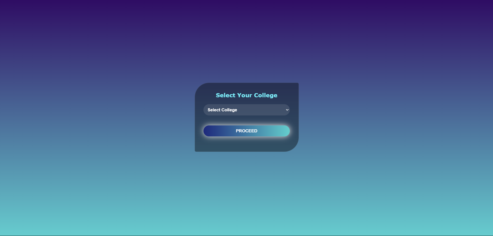
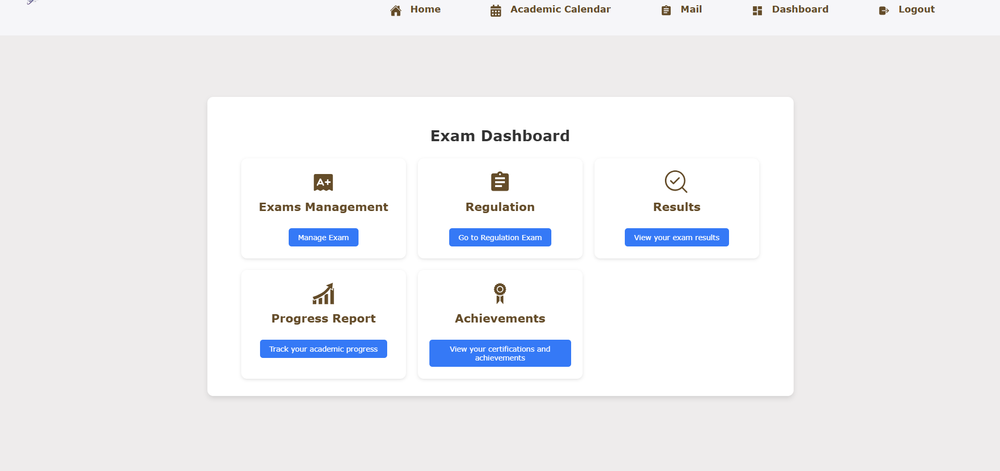

Here’s your full **README.md** with the screenshots section added at the end:

---

# 📚 ExamFaculty Authentication and Profile (MERN Stack)

This module handles login and profile functionalities for **ExamFaculty users** in a MERN-based application.

## 🌐 Tech Stack

- **Frontend**: React, Axios, React Router  
- **Backend**: Node.js, Express.js  
- **Database**: MongoDB  
- **Authentication**: JWT (stored in MongoDB for now)

---

## 🔐 Faculty Login Flow

### Login Request (`FacultyLogin.jsx`)
```js
axios.post("/api/faculty/login", data)
  .then(res => {
    localStorage.setItem("facultyToken", res.data.token);
    navigate("/faculty/profile");
  });
```

---

## 🧾 Faculty Profile Fetch

### Component (`FacultyProfile.jsx`)
- On mount (`useEffect`), fetches profile data.
- Sends a `GET` request to `/api/faculty/profile` with token in `Authorization` header.

```js
useEffect(() => {
  const token = localStorage.getItem("facultyToken");
  axios.get("/api/faculty/profile", {
    headers: { Authorization: `Bearer ${token}` }
  }).then(res => {
    setFacultyData(res.data);
  });
}, []);
```

### ✅ Ensure:
- Token is properly stored and passed.
- The backend returns faculty details as JSON.

---

## 🧠 MongoDB Schema Example (`faculties` Collection)

```json
{
  "_id": "faculty_id",
  "email": "example@college.com",
  "password": "hashed_password",
  "token": "jwt_token"
}
```

---

## 🚧 Common Issues & Debug Tips

| Issue                | Possible Cause / Fix                                  |
|---------------------|--------------------------------------------------------|
| Blank profile page   | `facultyData` not loaded yet → Use conditional rendering |
| Token not found      | Check if token is stored in `localStorage`            |
| No data in response  | Backend route might not be returning the data properly |
| Authorization missing| Confirm it's in the request headers (check DevTools)  |

---

## ✅ Final Notes

- Always wrap JSX with a condition:

```jsx
{facultyData && <h1>{facultyData.name}</h1>}
```

- Consider migrating token storage to **HTTP-only cookies** for better security in production.
- Implement **middleware authentication** for protected backend routes.

---

## 📁 File Structure

```
/frontend
  └── components
        ├── FacultyLogin.jsx
        └── FacultyProfile.jsx

/backend
  └── routes
        └── facultyRoutes.js
      └── controllers
        └── facultyController.js
      └── models
        └── Faculty.js
```


---

## 📸 Screenshots









---

## 💬 Author & Contact

Built by **Md Awesh**. For feedback or queries, feel free to reach out!

---

Would you like this saved as a `.md` file now?
